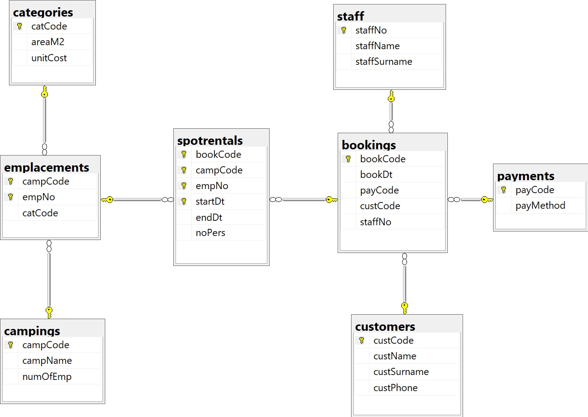
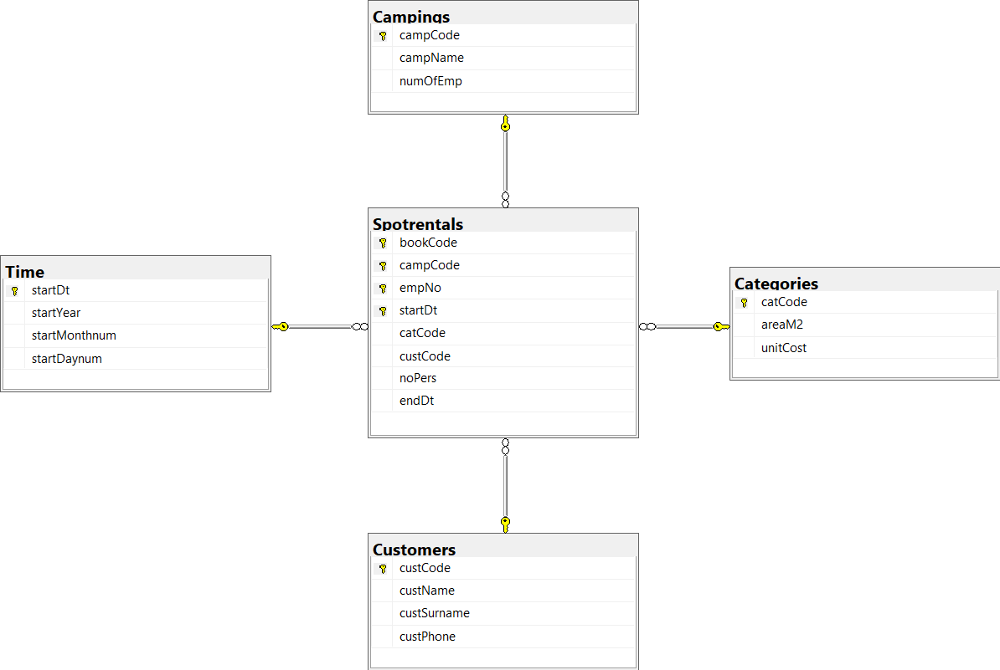

# aueb-sql-final-project-database

## Athens University of Economics and Business ([AUEB](https://aueb.gr/))
A [Coding Factory](https://codingfactory.aueb.gr/) @ [AUEB](https://aueb.gr/) SQL Project. Final Project

## Project info
- Campings Database Managment CAMPDW
- Read the pre-project requirements for implementation [here](https://drive.google.com/file/d/1_8gIdewyfhv6x67EeV9i8NTQllBPQgMl/view?usp=sharing)
- Read my complete final project [here](https://docs.google.com/document/d/1HrqLT3ozYDMu_xx_N4iPkm_lM2L2IUTUMjzC2TET6dU/edit?usp=share_link)

## Steps Briefing
1. **database-bulk.insert.sql**
    - creation of database
    - creation of table campData
    - Bulk insertion data from campData.txt given database file
2. **normalization-database.creation.sql**
    - Normalization (3d Normal Form)
    - creation of relational database
3. **insert-data-into-tables.sql**
    - Selection of Data from campData and insertion into tables
4. **select-queries-and-optimization.sql**
    - Several Select Queries testing
    - Index creation for queries optimization
 5. **fact-table-creation-StarSchema.sql**
    - Fact Table creation (Star Schema)
    - Data insertion into Fact Table
 6. **fact-table-queries.sql**
    - Several Queries execution
    - Rollup Report creation
    - CUBE Report creation
 7. PowerBi report (included in complete final project [link](https://docs.google.com/document/d/1HrqLT3ozYDMu_xx_N4iPkm_lM2L2IUTUMjzC2TET6dU/edit?usp=share_link))

  <h2>Database Diagram</h2>
  

  <h2>Fact Table</h2>
  

